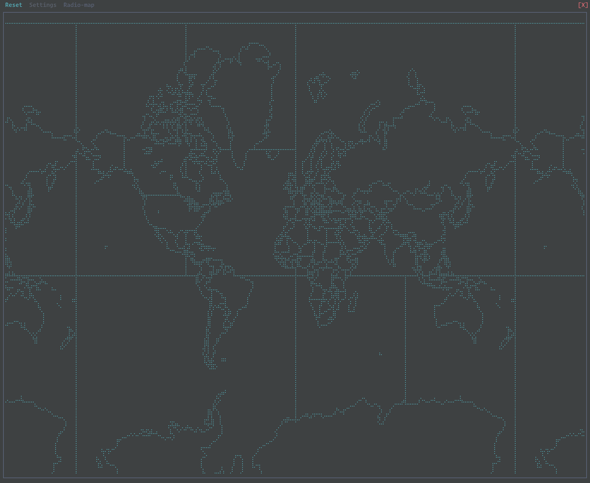
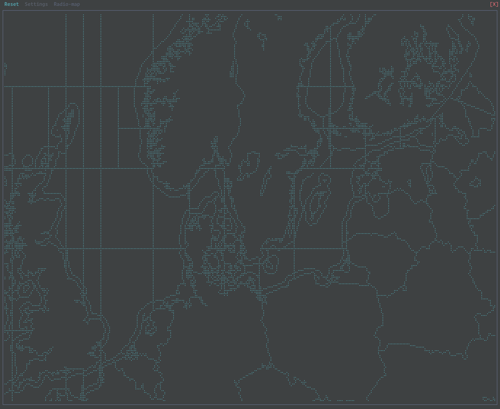
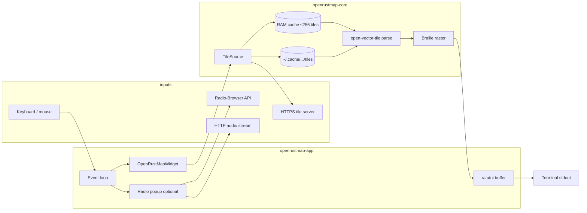
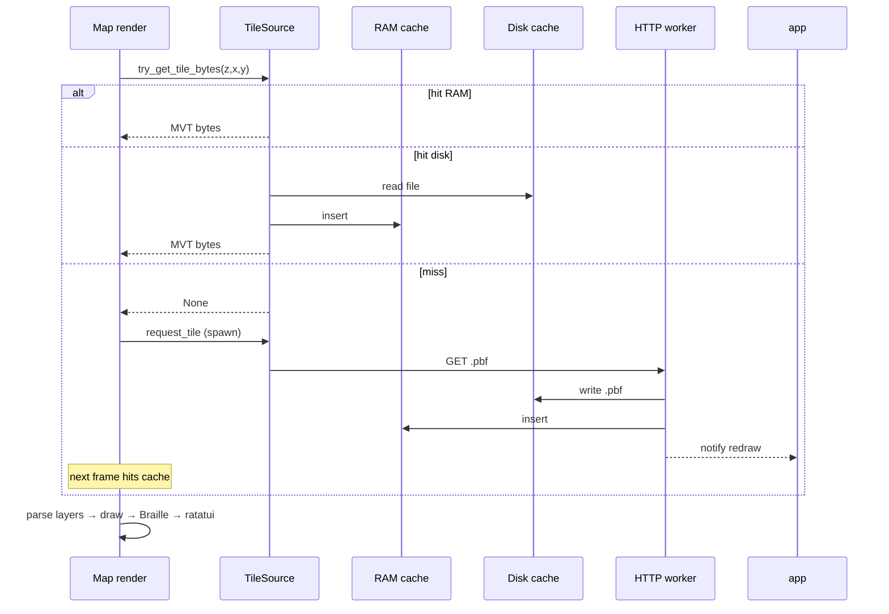

# OpenRustMap

Terminal (TUI) map viewer written in Rust. It renders a **2D map** with **Unicode Braille** (MapSCII-style), backed by **vector tiles** over HTTPS—not a mockup: a runnable app with an embeddable core library and a **Radio-Browser** “Radio-map” plugin.

This repo is a standalone product. Embed `openrustmap-core` if you want a map inside another TUI.

---
[## Preview

| Zoomed out, world wiev | Zoomed in to Scandinavia |
| ---------------------- | ----------------------- |
|  |        |


## Install

**Requirements**

- [Rust](https://rustup.rs/) (stable), **2024 edition** toolchain as used in the workspace.
- A real terminal with **mouse support** recommended (scroll, right-drag pan).
- Optional: **`mpv`** (or set `OPENRUSTMAP_RADIO_PLAYER`) for **external** Radio-map playback.

**From source**

```sh
# Clone this repository, then:
cd OpenRustMap
cargo build --release
```

Run the app:

```sh
cargo run --release -p openrustmap-app
```

Install the binary on your `PATH` (optional):

```sh
cargo install --path openrustmap-app
# binary typically: ~/.cargo/bin/openrustmap-app
```

**Config & cache (created at runtime)**

| Location | Purpose |
|----------|---------|
| `~/.config/openrustmap/settings.toml` | App toggles (e.g. Radio-map, prefer external player) |
| `~/.cache/openrustmap/tiles/` | Downloaded map tiles (see [Caching](#caching-map-tiles)) |

---

## Repo layout

| Crate | Role |
|-------|------|
| `openrustmap-core` | Map state, `TileSource`, MVT parse + Braille raster, `MapWidget` trait |
| `openrustmap-app` | Standalone TUI: menu, settings, map frame, event loop |
| `openrustmap-plugin-radiobrowser` | Radio-map popup: Radio-Browser API, native (cpal/symphonia) or external audio |

---

## What the app does (pipeline)

OpenRustMap **does not** ship a full OpenStreetMap database. It:

1. Fetches **Mapbox Vector Tiles (MVT)** as binary **`.pbf`** files from a configurable **HTTP base URL** (default **`https://mapscii.me/`**), using the usual slippy pattern: `{base}{z}/{x}/{y}.pbf`.
2. If the response is **gzip**’d, decompresses with **`flate2`** before parsing.
3. Parses with **`open-vector-tile`**, selects a small set of **layer names** (e.g. `road`, `water`, …—varies by zoom), and rasterizes line/polygon outlines with **Bresenham** into a pixel grid, then maps pixels to **Braille** codepoints.
4. Composes the result with **`ratatui`**; input/output via **`crossterm`** (raw mode, alternate screen, mouse).
5. **Radio-map** (optional): JSON from **Radio-Browser** (`api.radio-browser.info`), then HTTP **audio streams** via native decoder or an external player.

There is **no GPU**; everything is **CPU** and **terminal text**. Map interaction uses **background threads** for tile fetch so the UI stays responsive when a tile is missing.

---

## Stack (main dependencies)

| Layer | Crates / role |
|-------|----------------|
| TUI | **`ratatui`** — cell buffer, layout, popups |
| Terminal | **`crossterm`** — raw mode, keys, mouse, alternate screen |
| HTTP | **`reqwest`** (blocking, **rustls**) — tiles, Radio-Browser, streams |
| Tiles | **`open-vector-tile`** — MVT decode |
| Compression | **`flate2`** — gzip’d `.pbf` on the wire |
| Config | **`serde`**, **`toml`**, **`directories`** (XDG paths) |
| Radio (plugin) | **`serde_json`**, optional **`cpal`**, **`symphonia`**, **`rtrb`** |

---

## What gets downloaded

| Kind | What | When |
|------|------|------|
| **Map** | MVT **`.pbf`** per tile `{z,x,y}` | On demand for tiles in view (~**3×3** around center); missing tiles queued to a **worker thread** |
| **Radio-map** | **JSON** (search, by-geo, etc.) | When you open/use the Radio-map popup |
| **Playback** | **HTTP audio stream** | When you play a station (native or external) |

Radio search results are not written as a large on-disk archive in v1; the plugin keeps **session-oriented** caching (e.g. search strings), not a full offline station DB.

---

## Caching (map tiles)

Three tiers:

1. **RAM** — `TileSource` holds up to **256** decoded tile blobs (`Vec<u8>`) in a `HashMap`; simple eviction when full.
2. **Disk** — default **`$XDG_CACHE_HOME/openrustmap/tiles/`** (usually **`~/.cache/openrustmap/tiles/`**), layout **`tiles/{z}/{x}-{y}.pbf`** (decompressed payload stored as `.pbf`).
3. **Pending set** — avoids duplicate in-flight downloads for the same tile key.

**Lookup order:** memory → disk file → (if miss) schedule HTTP fetch; next redraw picks up the tile.

---

## Disk space

There is **no fixed quota** in code: usage grows with **how many distinct tiles** you load. Tiles are often **tens–hundreds of KB** each (varies by zoom and area). Typical browsing may stay in the **tens of MB**; heavy exploration without clearing cache can reach **hundreds of MB**.

Check on your machine:

```sh
du -sh ~/.cache/openrustmap
du -sh ~/.config/openrustmap
```

Config is tiny; almost all size is **`tiles/`**.

---

## Data flow



**Tile fetch sequence:**



---

## One-frame render path

1. Read **view state** (center, zoom capped, Braille flag).
2. Compute **tile grid** (integer zoom ≤ 14 for data; view can magnify further).
3. For each of up to **9 tiles**: get bytes (RAM → disk → or async fetch).
4. **Parse MVT**, draw allowed layers with a **per-frame segment budget** (fewer layers at high zoom).
5. Fill **ratatui** buffer; draw menu, **map frame**, popups, footer.

On **panic or exit**, the app restores **normal terminal mode** (raw off, mouse capture off, alternate screen off) so the shell does not receive stray mouse escape sequences. Wheel zoom is **throttled**; tile loads use **background threads**.

---

## Controls (summary)

- **Map:** arrows pan; `a` / `z` zoom (tiles **z14** max; view up to **~16** for magnification); mouse wheel zoom; right-drag pan; **frame** around the map; `r` reset; `q` quit. Minimum terminal about **95×35**.
- **Radio-map:** open from menu when enabled; `Tab` nearby vs search; `Enter`; `m` playback mode; `p` / `+` / `-` / `x` (native path); mouse on list; Settings `s` — `t` / `e` toggles.
- **Attribution:** map data / tiles depend on your **tile base URL** and provider terms; follow OSM and provider attribution when distributing the app.

---

## License

MIT (for this repo’s code). Respect **OpenStreetMap** and your **tile provider** attribution and licenses for map data and endpoints.

---

## Roadmap — completing Radio-Browser / Radio-map

Work remaining to treat the Radio-map plugin as **feature-complete** for a solid v1:

- [ ] **Robust playback** — clearer errors for unsupported codecs; optional **ffmpeg** / system-player fallback where Symphonia cannot decode; document known stream types.
- [ ] **API resilience** — Radio-Browser server list / failover; sane timeouts and user-visible failure messages.
- [ ] **Station metadata** — show codec/bitrate/tags in the list when the API provides them; optional **favorites** or **recent** list (local JSON under `~/.config/openrustmap/`).
- [ ] **Geo UX** — when a station has no coordinates, keep a consistent message and optional “center map on country” fallback.
- [ ] **Search UX** — debouncing, clearer empty states, keyboard help line aligned with actual bindings.
- [ ] **Plugin host** — load/disable plugins from config (`plugins/` dir), top-menu entries for discovered plugins (see core roadmap).
- [ ] **Tests** — mock HTTP for API client; smoke test for popup state machine.

Broader product roadmap (map styling, labels, async tile prefetch, MBTiles, etc.) lives in **`ROADMAP.md`**.
